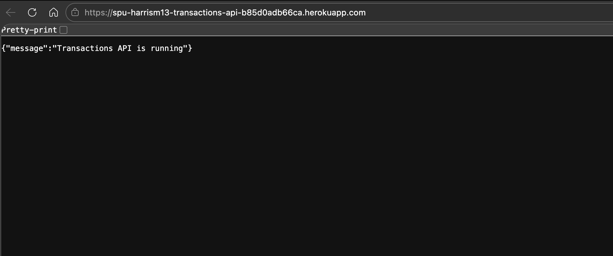
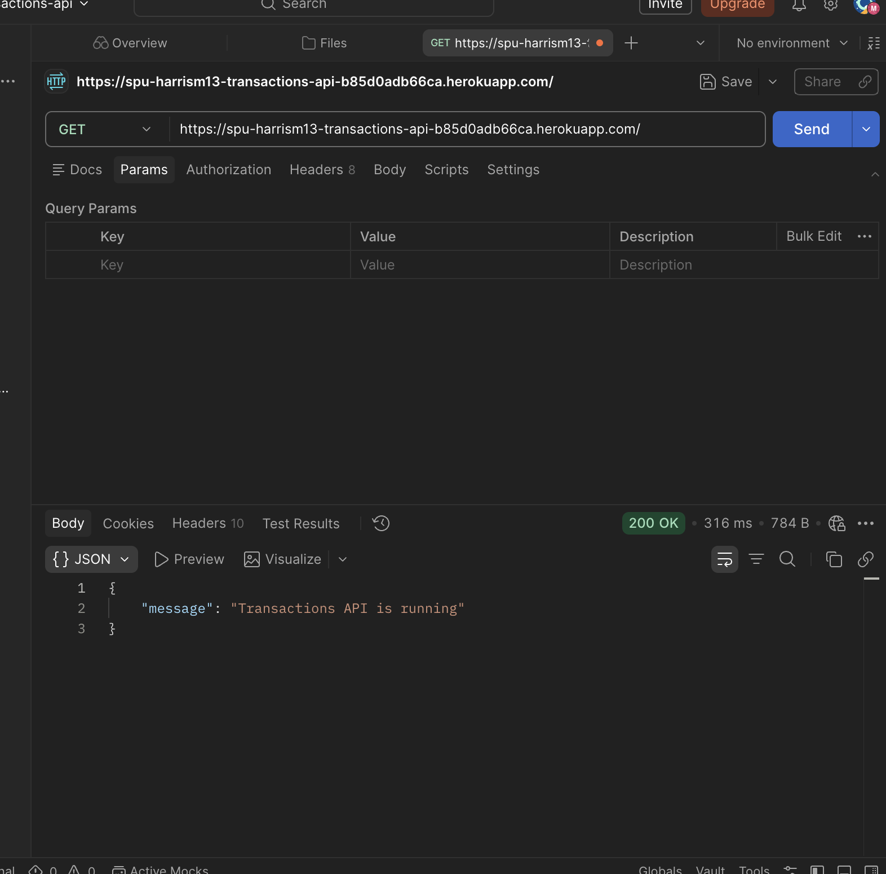
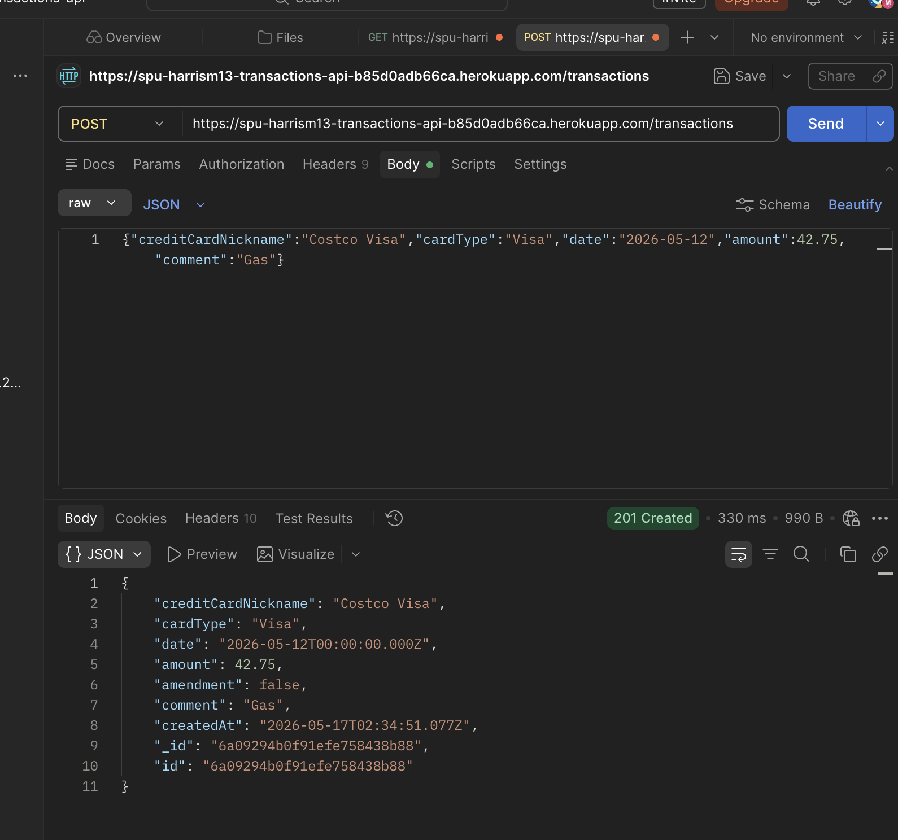
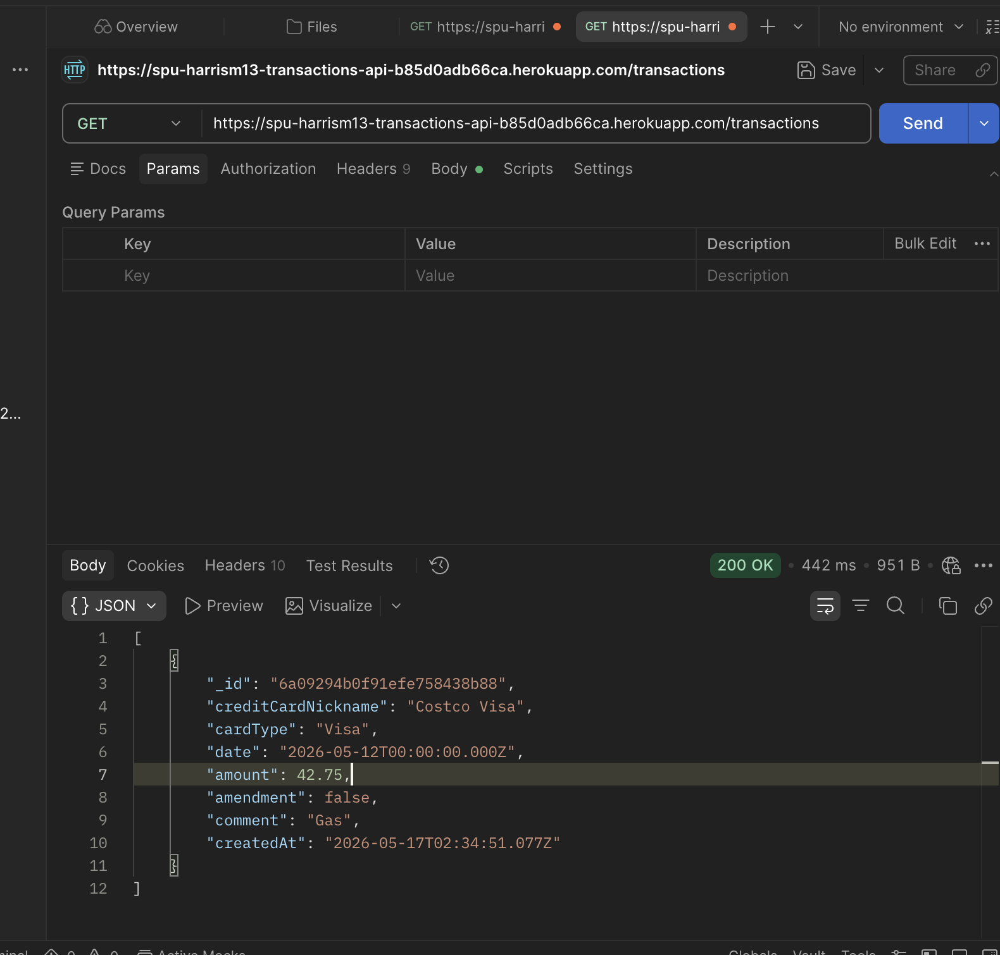
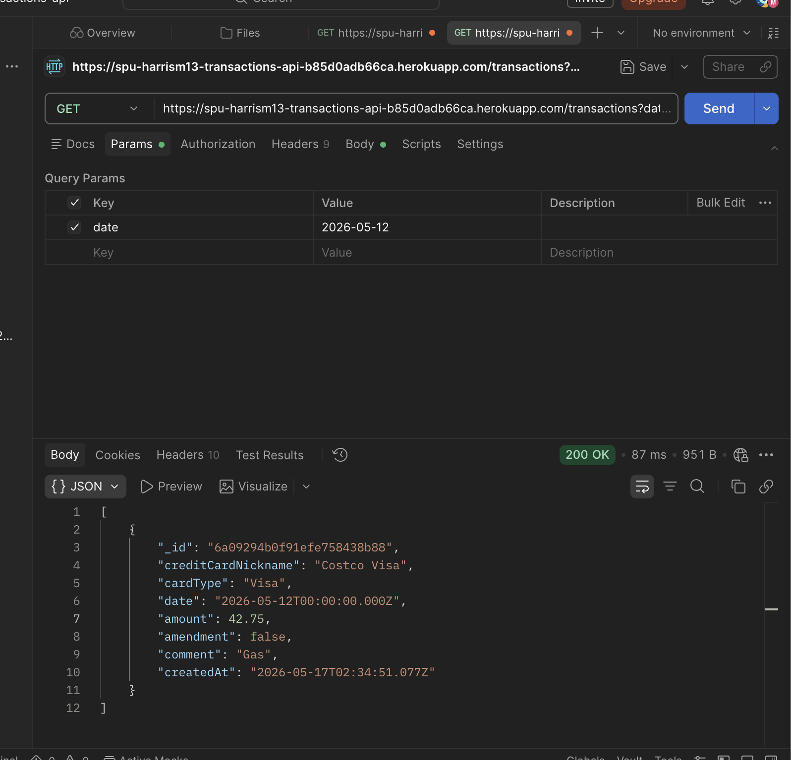
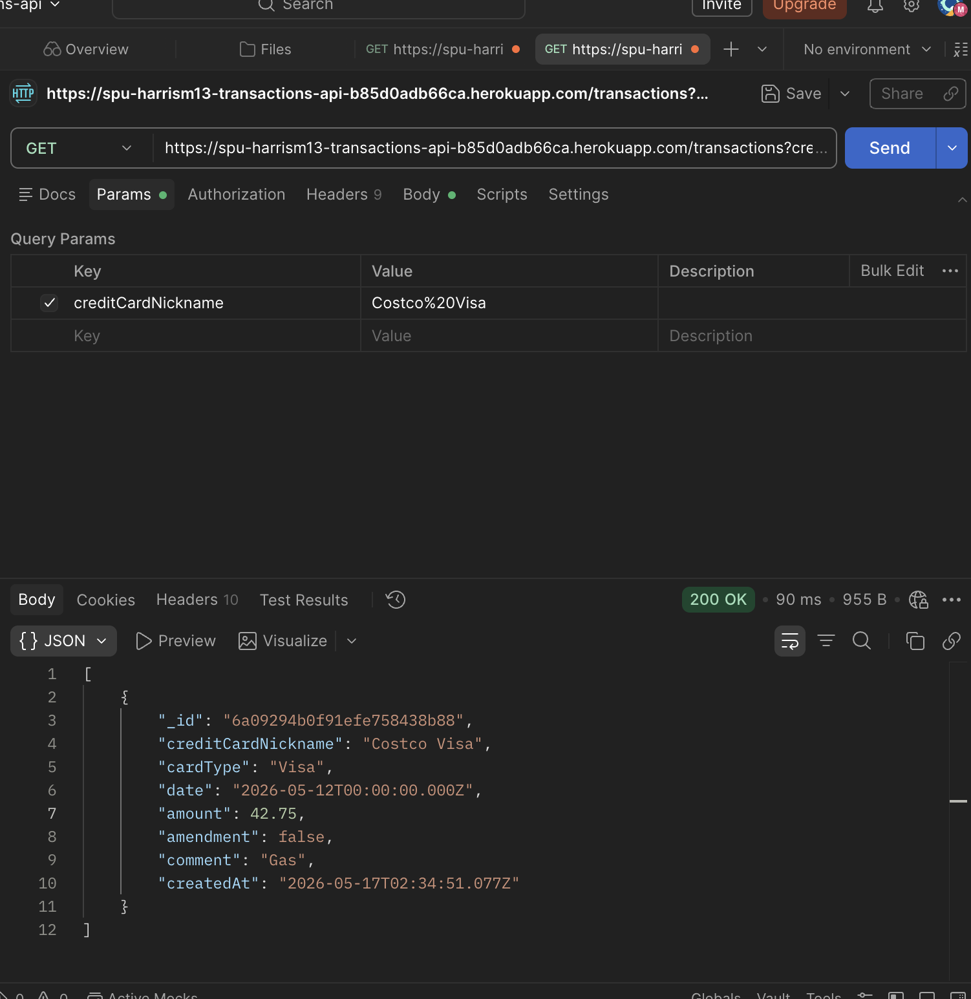

# transactions-api

What were the new things you learned in this activity? 
I learned how to connect Express to MongoDB, run the app in Docker with a dev container, use environment variables for the database URL, deploy to Heroku with a Procfile, and use MongoDB Atlas with network access for cloud hosting.

What is the purpose of the seed.js program? 
It fills the database with sample transactions so you can test GET routes and filters without creating every record by hand.

What was the most dificult thing to do in this activity? 
Getting Heroku to talk to Atlas was the hardest part, especially fixing the IP allowlist so the dyno could connect.

How would you say you were prudent in this assignment? 
I kept passwords and connection strings out of git, used .env and Heroku config vars, and did not commit secrets.

How would you say you need to be prudent when developing this kind of web applications? 
You need to protect credentials, limit database access, validate input, and avoid exposing sensitive data in repos or logs.

URL of your deployed application as a link. https://spu-harrism13-transactions-api-b85d0adb66ca.herokuapp.com/

Screenshots of Postman making requests to your deployed application

GET / (browser)



GET / (Postman)



POST /transactions



GET /transactions



GET /transactions?date=2026-05-12



GET /transactions?creditCardNickname=Costco Visa




REST API for credit card transactions using Node.js, Express, and MongoDB. Local development uses Docker and a VS Code Dev Container.

## Data model

Each transaction includes `creditCardNickname`, `cardType`, `date`, `amount`, `amendment`, and `comment`. The API is append-only (no PUT, PATCH, or DELETE).

## Setup

1. Copy `.env` and set:

   - `PORT=3000`
   - `MONGODB_URI` — local Docker: `mongodb://db:27017/transactionsdb`; production: your Atlas URI with database name in the path (for example `.../transactionsdb`).

2. Install dependencies:

   ```bash
   npm install
   ```

## Run locally

```bash
npm run dev
```

Seed sample data:

```bash
npm run seed
```

## API

| Method | Path | Description |
|--------|------|-------------|
| GET | `/` | Health message |
| POST | `/transactions` | Create a transaction |
| GET | `/transactions` | List (optional query: `date`, `startDate`, `endDate`, `creditCardNickname`) |
| GET | `/transactions/:id` | Get one by MongoDB `_id` |

## Docker

```bash
docker compose up --build
```

## Dev container

Open the folder in **Visual Studio Code**, then use **Dev Containers: Reopen in Container** so the app and MongoDB run in Compose.

## Heroku

- `Procfile` runs `web: node server.js`.
- Set `MONGODB_URI` on the app: `heroku config:set MONGODB_URI="..."`.
- Deploy: `git push heroku main` (from your machine, not inside the container).
